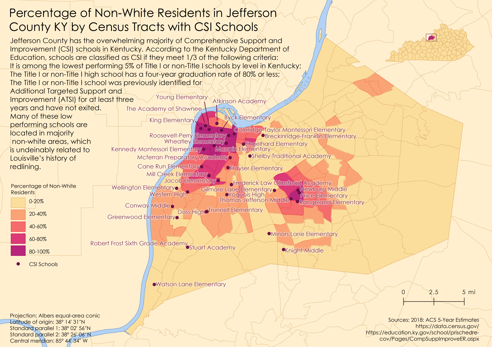
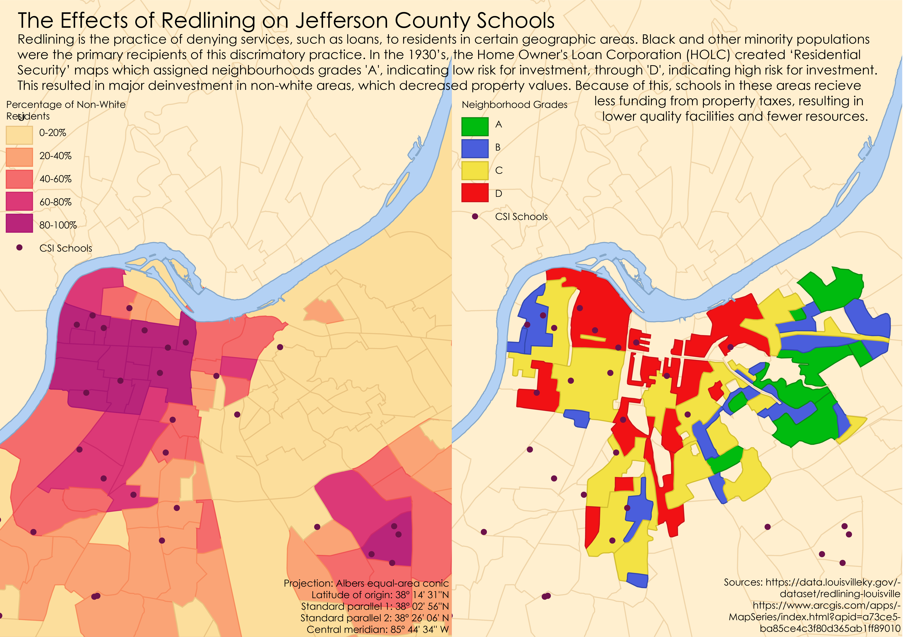

# Map Portfolio 
**Gyula Pauer Cartography Award Submission**
## Project 1, GEO 305 Final Project (Fall 2020)

[Full Size](maps/305finaluse.png)

[Full Size](maps/305finalredlininguse.png)

*Made using QGIS and Adobe Illustrator* 

For project 1, I wanted to understand where low performing schools are located and what communities they affect in my home-city of Louisville. For the comparison map, I wanted to see how these schools were potentially influenced by redlining practices. For the design, I included the names of each school to show the variety of school types and age ranges they serve. In the redlining map, I decided to keep the points the same color for easier comparison. 

## Project 2, GEO 309 Final Project (Fall 2020)

[Full Size](maps/309finaluse.png)

*Made using QGIS and Adobe Illustrator*

For project 2, I wanted to see if there was any correlation between asthma rates, poverty, and proximity to polluting factories identified by the EPA. I was surprised that the vast majority of these factories are located in low-income areas. For the design, I used a custom bivariate color scheme. I decided to only include the labels of the highest polluting factories to avoid crowding. I also include their RSEI score to further highlight their damage to these areas. 

## Project 3, GEO 409 Module 6 (Spring 2021)

[Full Size](maps/409rrg.png)

*Made using ArcGIS* 

For project 3, I was tasked with creating a map of arches in Red River Gorge. As someone who hasn't visited this area in a while, creating this map helped me to better understand where I was mapping. For the design, I wanted to emphasize the arch locations and draw less attention on the stream names. I then added a county map of Kentucky with the mapping area outlined. Lastly, I added an image of one of the arches to show the character of Red River Gorge.